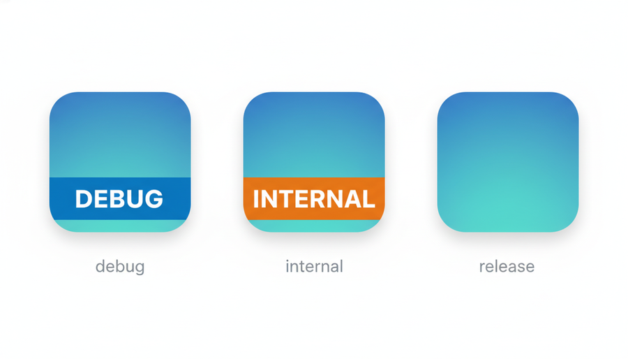
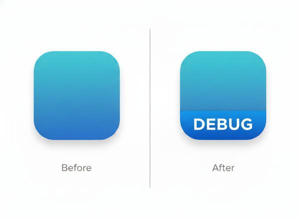

<div align="center">

# App Icon Banner

**One DSL. Android + iOS. Know your build at a glance.**

[](https://github.com/nkrebs13/app-icon-banner/actions/workflows/build.yml)
[](https://plugins.gradle.org/plugin/io.github.nkrebs13.app-icon-banner)
[](LICENSE)



</div>

A Gradle plugin for **Kotlin Multiplatform** projects that stamps a color + label banner onto app icons per build variant. A single `appIconBanner { }` block drives banner rendering for both Android and iOS using the same **ImageMagick** renderer — identical output on both platforms.

## Requirements

Gradle 8.4+, Android Gradle Plugin 8.4+, JDK 17. Both Android and iOS stamping require a Freetype-enabled [ImageMagick](https://imagemagick.org) on the build machine:

```bash
brew install imagemagick
```

Since this plugin is designed for KMP projects (which always have an iOS target), ImageMagick is a single prerequisite that covers both platforms.

## Install

Apply the plugin in your Android application module **after** the Android plugin:

```kotlin
// app/build.gradle.kts  (or androidApp/build.gradle.kts in a KMP project)
plugins {
    id("com.android.application")
    id("io.github.nkrebs13.app-icon-banner") version "0.1.0"
}
```

That's it for Android. Debug builds immediately get a blue **DEBUG** banner — no extra configuration required. The plugin stamps all launcher icon densities (`mipmap-*`) including the adaptive icon foreground layer, using ImageMagick with the correct safe-zone geometry for each type.

## Configuration

```kotlin
appIconBanner {
    buildType("debug")    { color = "#0288D1"; label = "DEBUG" }
    buildType("internal") { color = "#FF6F00"; label = "INTERNAL" }
    // release → no banner

    // Flavor-specific (applies to every variant of that flavor)
    flavor("meta")        { color = "#7B1FA2"; label = "META" }

    // Most specific wins (overrides buildType + flavor for exactly this variant)
    variant("metaDebug")  { color = "#1565C0"; label = "META·DBG" }

    // iOS only: map a custom Xcode configuration that has no Android equivalent
    iosConfiguration("Firebase") { color = "#FF6F00"; label = "FIREBASE" }
}
```

**Resolution priority** (most specific wins, never stacked): `variant` > `flavor` > `buildType` > built-in debug default.

- `color` must be `#RRGGBB`. Defaults to `#0288D1` (blue) when omitted.
- `label` must not contain `|` (config-file field separator) or `%` (ImageMagick format specifier). Defaults to the slot name when omitted.
- Set `debugDefault = false` to opt out of the automatic debug banner.

### Three-tier recipe

The most common pattern: debug builds on-device, a tester distribution (Firebase App Distribution / TestFlight), and a clean production build — all installable side-by-side.

```kotlin
android {
    buildTypes {
        debug {
            applicationIdSuffix = ".debug"
        }
        create("internal") {
            applicationIdSuffix = ".internal"
            // Library modules need this to resolve their dependencies to the release variant.
            matchingFallbacks += listOf("release", "debug")
            isMinifyEnabled = true
        }
        release { /* no suffix, no banner */ }
    }
}

appIconBanner {
    buildType("debug")    { color = "#0288D1"; label = "DEBUG" }
    buildType("internal") { color = "#FF6F00"; label = "INTERNAL" }
}
```

> **Gotcha:** any `buildType` beyond `debug`/`release` needs `matchingFallbacks` on each library module or AGP throws `NoMatchingVariantSelectionException`. This is an Android Gradle concern — the banner plugin is just the most common trigger.

## iOS setup



The iOS banner is stamped by a bash + ImageMagick CLI at Xcode build time.

**1. Split your icon set into a pristine base** (first time only):

```bash
cd YourApp/Assets.xcassets
cp -R AppIcon.appiconset AppIcon-base.appiconset
echo "YourApp/Assets.xcassets/AppIcon.appiconset/" >> ../../.gitignore
git add AppIcon-base.appiconset
```

The CLI regenerates `AppIcon.appiconset` from `AppIcon-base.appiconset` on every Xcode build — re-running never double-stamps.

**2. Export the config + CLI** from your Android module:

```bash
./gradlew exportIosBannerConfig
```

Commits both `app-icon-banner.config` and `scripts/app-icon-banner`.

**3. Add a Run Script phase** in Xcode (target → Build Phases → + → New Run Script Phase), **before** "Copy Bundle Resources", **uncheck** "Based on dependency analysis":

```bash
"${SRCROOT}/scripts/app-icon-banner" \
    --config "$CONFIGURATION" \
    --appiconset "$SRCROOT/YourApp/Assets.xcassets/AppIcon.appiconset"
```

### KMP: redirect iOS outputs to `iosApp/`

In a typical KMP project the Android plugin lives in `:composeApp` or `:androidApp`, so `exportIosBannerConfig` writes to that module's directory by default. Redirect it to sit next to the iOS app instead:

```kotlin
// androidApp/build.gradle.kts
import io.github.nkrebs13.appiconbanner.ios.ExportIosBannerConfigTask

tasks.named<ExportIosBannerConfigTask>("exportIosBannerConfig") {
    outputConfig.set(rootProject.layout.projectDirectory.file("iosApp/app-icon-banner.config"))
    outputCli.set(rootProject.layout.projectDirectory.file("iosApp/scripts/app-icon-banner"))
}
```

The Xcode Run Script then references `${SRCROOT}/scripts/app-icon-banner` as usual since `$SRCROOT` for the iOS target is `iosApp/`.

### CLI tuning

The defaults are sized for the iOS squircle mask — the band is inset so no descenders are clipped.

```
--height-pct N        band height as % of icon (default: 18)
--bottom-inset-pct N  band lifted N% above bottom edge (default: 8, clears squircle curve)
--text-pct N          text size as % of band height (default: 55)
--font <path>         explicit TTF/TTC path (macOS system fonts used by default)
```

## Troubleshooting

**`ImageMagick not found`** — Install: `brew install imagemagick`. If it is installed but Xcode can't find it, add `export PATH="/opt/homebrew/bin:$PATH"` at the top of your Run Script.

**`this ImageMagick build lacks the Freetype delegate`** — Reinstall the full build: `brew reinstall imagemagick`.

**`no usable font found`** — Pass a font path explicitly with `--font /path/to/Font.ttf`. On Linux CI use a DejaVu or similar system font.

**`appIconBanner: invalid color '...'`** — Gradle build error. Use `#RRGGBB` format (six hex digits), e.g. `#FF6F00`.

**`appIconBanner: label '...' must not contain '%'`** — ImageMagick interprets `%`-prefixed sequences in annotation text (e.g. `%w`, `%[fx:...]`). Choose a label without `%`.

**`NoMatchingVariantSelectionException`** — Add `matchingFallbacks` to each library module for any custom build type. See the three-tier recipe above.

**Squircle clipping** — Increase `--bottom-inset-pct` (try 12) if the banner is still clipped by the corner curve on your device.

## License

MIT — see [LICENSE](LICENSE).
