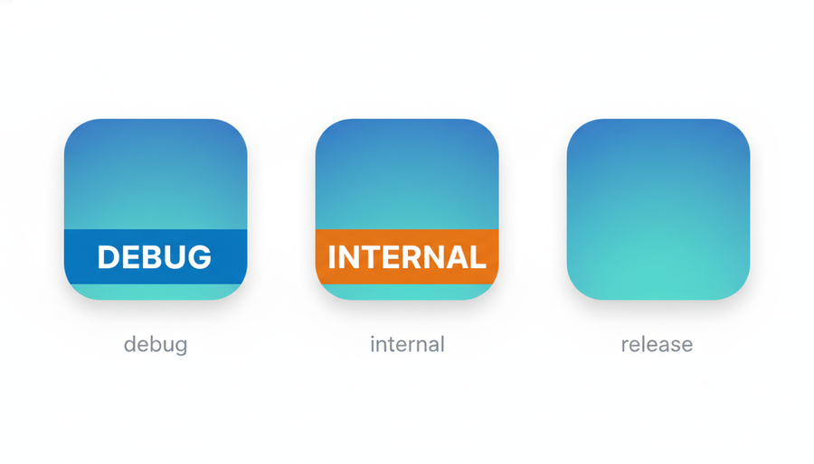
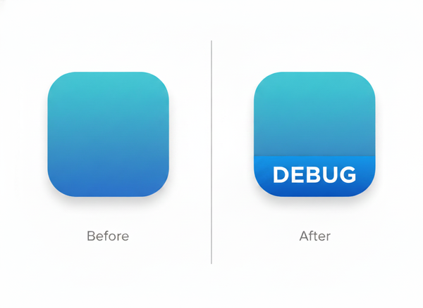

<div align="center">

# App Icon Banner

**One Gradle DSL for KMP. Banner-stamp Android and iOS icons from a single config.**

[](https://github.com/nkrebs13/app-icon-banner/actions/workflows/build.yml)
[](https://plugins.gradle.org/plugin/io.github.nkrebs13.app-icon-banner)
[](LICENSE)



</div>

A Gradle plugin for Kotlin Multiplatform projects that stamps a color + label banner onto app icons per build variant. One `appIconBanner { }` block drives both Android and iOS using the same ImageMagick renderer — identical output on both platforms.

## Requirements

Gradle 8.4+, AGP 8.4+, JDK 17, and a Freetype-enabled [ImageMagick](https://imagemagick.org):

```bash
brew install imagemagick
```

## Install

Apply the plugin in your Android application module **after** the Android plugin:

```kotlin
// app/build.gradle.kts  (or composeApp/build.gradle.kts in a KMP project)
plugins {
    id("com.android.application")
    id("io.github.nkrebs13.app-icon-banner") version "0.1.1"
}
```

Debug builds immediately get a blue **DEBUG** banner — no configuration required.

## Configuration

The most common setup: debug on-device, an internal tester build, and a clean production build — all installable side-by-side:

```kotlin
android {
    buildTypes {
        debug {
            applicationIdSuffix = ".debug"
        }
        create("internal") {
            applicationIdSuffix = ".internal"
            matchingFallbacks += listOf("release", "debug")
            isMinifyEnabled = true
        }
        release { /* no suffix, no banner */ }
    }
}

appIconBanner {
    buildType("debug")    { color = "#0288D1"; label = "DEBUG" }
    buildType("internal") { color = "#FF6F00"; label = "INTERNAL" }
}
```

> **Gotcha:** any `buildType` beyond `debug`/`release` needs `matchingFallbacks` on each library module or AGP throws `NoMatchingVariantSelectionException`.

→ [Full DSL reference — flavors, variants, iOS configurations, all properties](docs/configuration.md)

## iOS



The iOS banner is stamped by the bundled bash + ImageMagick CLI at Xcode build time. Setup takes three steps: split your icon set into a pristine base, export the config, and add a Run Script phase.

→ [iOS Setup Guide](docs/ios-setup.md)

## Troubleshooting

**`ImageMagick not found`** — Install: `brew install imagemagick`. If Xcode can't find it, add `export PATH="/opt/homebrew/bin:$PATH"` at the top of your Run Script.

**`this ImageMagick build lacks the Freetype delegate`** — `brew reinstall imagemagick`.

**`no usable font found`** — On Linux CI: `sudo apt-get install -y fonts-dejavu-core`. On macOS: the plugin finds system fonts automatically after a standard Homebrew ImageMagick install.

**`appIconBanner: invalid color '...'`** — Use `#RRGGBB` format, e.g. `#FF6F00`.

**`appIconBanner: label '...' must not contain '%'`** — ImageMagick interprets `%`-prefixed sequences. Choose a label without `%`.

**`NoMatchingVariantSelectionException`** — Add `matchingFallbacks` to each library module for any custom build type.

**Squircle clipping** — Increase `--bottom-inset-pct` (try 12) in your Xcode Run Script.

## License

MIT — see [LICENSE](LICENSE).
